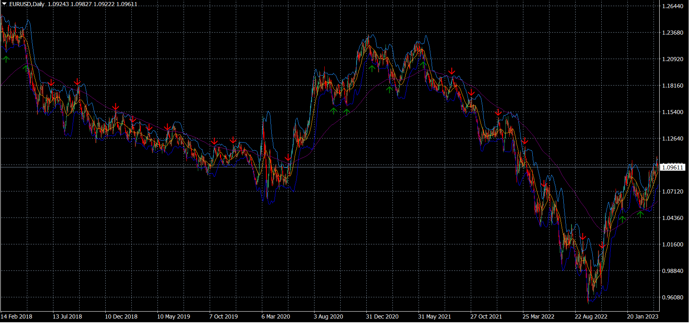

# Bollinger bands algoritme
 Dette er en simpel indikator som bruker bollinger bands og moving average til å opprette kjøps/salgsanbefalinger. Når ett candlestick når ett upper/lower bånd, det har gått 30 bars siden sist kjøp/salg, og den er i lik trend som det moving average er, så kommer et kjøps/salgssignal. F. eks har moving averaget negativ stigning, vil kun short signaler komme når et candlestick når det øverste båndet. Det vil ikke oppstå noen kjøpssignaler fordi det er i mot den generelle trenden. 
 Koden ligger vedlagt på github og er skrevet i mql4 som er ett innbakt programmeringspråk i handels/analyseplatformen metatrader 4. 

