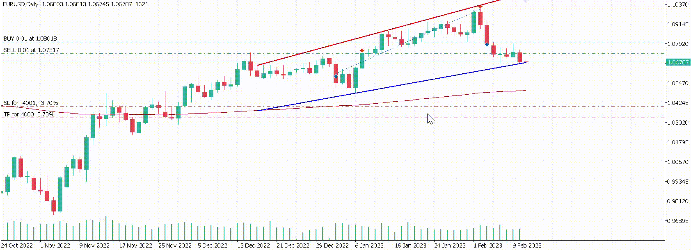

# Trendkanal algoritme
Denne tradingalgoritmen oppretter en trendkanal basert på topp og bunnpunkter, for så å handle på dette. Trendkanalen starter på nytt/slutter ved signalet fra et moving average. F. eks når moving average skifter fra negativ til positiv stigning starter trendkanalen på nytt. Akkurat nå er strategien å kjøpe og selge seg tilbake inn i trendkanalen hvis prisen treffer en av trendlinjene. Altså, hvis prisen treffer motstandslinjen så shorter den, og vice verca hvis den treffer støtte. Tanken er da at prisen holder seg inne i trendkanalen. Orderen blir behandlet og avsluttet med ett trailing stop loss.

